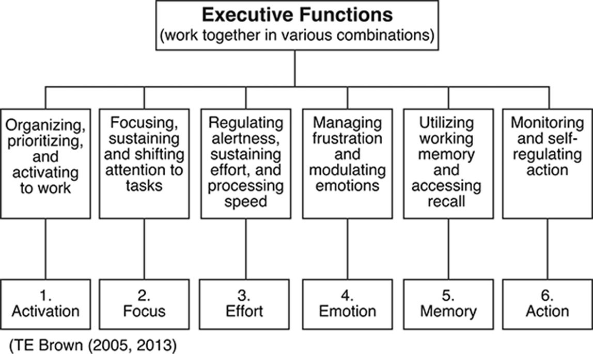

# ADHD: 大脑自我管理系统的问题

## 1. ADHD的新理解

ADHD不再被简单地视为儿童的行为问题,而是被理解为大脑自我管理系统发展的复杂问题。

有一个简单的等式:

> **ADHD = 执行功能的发展障碍**

执行功能是作为每个人自我管理系统的复杂大脑功能集合。

执行功能在学龄前年开始萌芽,并在早期学龄年到青春期和成年早期逐渐发展。在大多数人中,执行功能直到青少年后期或成年早期才完全发展。

## ADHD 执行功能障碍模型

### ADHD 障碍的四个基本事实

1. ADHD 不是非黑即白的分类,而是类似抑郁症的程度问题。

2. 执行功能通常快速自动运行,无需太多有意识的思考。

3. ADHD 中受损的执行功能是一种可遗传的综合征。

4. ADHD 的执行功能障碍具有"情境可变性"。

> 所有被诊断为 ADHD 的人中,大约四分之一有一个患有 ADHD 的父母。其余三个通常至少有一个其他近亲血亲患有 ADHD:兄弟姐妹、祖父母、姑姑或叔叔。ADHD 综合征在家族中遗传。

## 执行功能障碍的例子

### Cluster 1: 激活: 组织、优先排序和开始

这个 Cluster 涉及组织任务和材料、估计时间、确定任务优先级以及开始工作类任务的困难。人们常常因为拖延而遇到慢性困难。他们经常推迟开始一项任务，直到最后一刻，即使他们认识到这项任务对他们很重要。

#### 难以开始

一位患有 ADHD 的律师这样描述他在确定优先顺序和开始工作方面的困难：

> 我一生都很难独自开始工作。我在办公室里有几个小时的文书工作要做。我需要完成它，因为完成后才能获得报酬。我为此腾出几个小时时间，所有需要的材料都摆在我面前的办公室里。
>
> 但我就是无法让自己开始。通常我最后会打开电脑，坐在办公室里查看电子邮件，浏览一些新闻网站，玩电子游戏。每次秘书进来时我都得关掉，这样她就看不到我在做什么。一天结束了，我的工作甚至还没开始。

#### 难以确定优先顺序和组织

另一个在组织、确定优先顺序和开始工作方面遇到困难的例子是由一位寻求 ADHD 治疗的家庭主妇描述的：

> 我丈夫说我连两辆车的葬礼都组织不好。这让我很生气，但我想他是对的。当我有一堆事情要做时，它们似乎都同样重要。比如当我在打扫房子时。我试图整理一下客厅，拿起昨天的报纸，然后我就开始读了。然后我上楼去拿吸尘器，当我在楼上时，我看到了上周洗出来的一个照片信封。我坐下来把它们放进相册，然后就开始看相册里的其他照片了。即使是付账单时也会发生这种情况。我经常把当天的所有邮件都倒进一个大篮子里，甚至都不分类。

### Cluster 2: 聚焦: 集中、持续和转移注意力

这个 Cluster 涉及持续关注工作类任务或在需要时将注意力从一项活动转移到另一项活动的问题。对于 ADHD 患者来说，专注于特定任务并保持注意力往往很困难。有时，他们可能很容易被周围发生的事情或自己头脑中的想法分心。

#### 听讲时保持专注

一位高中生将他的问题比作开车时失去广播信号：

> 在我的课堂上，我总是能听到部分内容。但无论我多么努力，我都会不断失去对正在发生的事情的跟踪。就像在几何课上，我会听老师解释如何解决这个问题，然后我就走神一小会儿。我回过神来试图弄清楚他现在在哪里，然后很快我又失去了注意力。然后我会再听到一部分，但通常我不知道他是如何到达那里的，因为我走神了。

#### 难以过滤干扰

另一个无法专注于预定任务的问题是过度分心。即使他们已经集中注意力阅读、倾听或尝试做其他工作，ADHD 患者也常常感到被干扰所吸引。他们无法忽视周围环境中无数的想法、背景噪音和感知。

> 我什么都没错过，除了我应该注意的东西。当我在我的隔间工作时，我总是在听别人在做什么。我就是控制不住自己。如果两个隔间外的一个秘书在打电话，我就会偷听并试图弄清楚他们在谈论什么。同时，我还在查看走廊对面咖啡机那里发生的事情，以及谁刚刚进了洗手间。当我试图同时跟踪几个不同的电话对话时，这并不容易。

### Cluster 3: 努力: 调节警觉性、维持努力和调整处理速度

这个 Cluster 包括个人在保持警觉以及入睡和保持足够的工作相关任务effort方面可能遇到的问题。许多患有 ADHD 的人可以很好地完成短期项目，但在较长时间内保持持续的努力却困难得多。他们可能需要比其他人更长的时间来处理和反应他们所看到或听到的，他们可能会发现很难按时完成任务，特别是当他们需要完成写作任务时。

#### 难以入睡和醒来

一名会计师描述了他的睡眠和醒来困难:

> 我母亲告诉我,从我出生后的前几个月开始,她就一直很难让我安静下来睡觉。我从不怎么午睡,总是个夜猫子。她总是说我不想闭上眼睛,因为我害怕会错过一些有趣的事情。
>
> 直到今天,我仍然很难让自己入睡。我可能累得眼睛模糊,几乎要倒下了,我躺在床上,但就是无法让我的头脑关闭,这样我就可以入睡。它只是不断地回顾我一直在思考的任何事情。

#### 难以维持 effort

一位在市场营销公司担任主管的女性抱怨她在稳定工作方面存在不同类型的问题，尽管她在非常高效地完成其他任务方面没有困难：

> 如果我能很快完成某项工作，我通常会做得很好。当办公室的人打电话给我，让我解决与客户打交道时遇到的问题，甚至让我帮助他们解决电脑上的小故障时，我总是很开心。如果我能一直做这种快速解决问题的工作，我会是一个很棒的员工。
>
> 我对长期项目感到头疼，就是那种你无法在几分钟、几小时甚至一整天的时间里一口气完成的项目，而是需要持续不断地一点点完成，因为即使花上一整天的时间也不一定能完成。我对那些事情很快就失去了兴趣。一开始我会告诉自己："好的，我会全身心投入这项工作，坚持每天完成一部分，直到完成为止。"但没过多久我就感到厌烦，失去了兴趣。

#### 难以调节处理速度

一位高中毕业班的女生报告说，她在课堂上做笔记和在规定时间内完成论文考试或写作作业时遇到困难：

> 这不仅发生在我记笔记的时候。当我写论文或考试答题时，无论我多么努力，我总是无法足够快地写出答案。我的思维在思考问题和产生想法时很快，但在把想法写下来时却很慢。我觉得我就像是一台运行速度很快但调制解调器速度很慢的电脑。上传或下载我需要的信息需要很长时间。

### Cluster 4: 情绪: 管理挫折和调节情绪

这个 Cluster 包括个人在调节情绪反应方面可能遇到的困难，这些反应可能会过度占据他们的思想或行为。虽然 DSM-5 没有将任何与情绪管理相关的症状认定为 ADHD 的一个方面，但许多患有该综合症的人描述了在管理挫折、愤怒、恐惧、失望、担忧、欲望和其他情绪方面的慢性困难。

#### 难以调节易怒情绪

一位中年推销员这样描述他对烦恼的不成比例的反应:

> 我去小餐馆吃晚餐。是下午中期,地方相当安静。大多数人都已经吃过了。我在吃三明治,心情很好。然后坐在我后面的这个家伙拿到了他的三明治,他咀嚼得太大声了。每一口都是"嚼嚼嚼"。他嘈杂的咀嚼声很快让我感到烦躁。它快把我逼疯了。
>
> 就像我的头脑里有一个电脑病毒,占据了所有空间。这就是我能想到的全部 - 他嚼三明治的令人讨厌的声音。突然我意识到我的拳头握紧了,我认真地在考虑站起来打这个家伙的嘴!我没这么做是因为我不想被逮捕。但如果我在家,我会对某人大喊大叫的。

#### 过度敏感

易怒和愤怒并不是 ADHD 患者唯一有问题的情绪。许多 ADHD 患者在调节其他情绪方面也有同样或更大的困难，如受伤、悲伤、欲望、担忧或沮丧。一位大公司的销售人员讲述了他在另一种情绪反应方面的问题：

> 上周在办公室，我在走廊上看到一个在另一个部门工作的朋友。他一边走路一边看文件。我友好地打了个招呼，以为他会停下来聊几分钟，因为我很久没见到他了。但他只是微微抬头，快速地对我说了声"嗨"，然后继续走他的路。
>
> 大多数人会立即把这种情况抛在脑后，认为他只是赶着去开会或专注于他正在阅读的东西。但我不是。我一直在反复思考这件事。我一直在想，"为什么他不更友好一些？我是不是做了什么惹他生气的事？我是不是做了什么惹恼了他部门的其他人，现在他们都生我的气？"

#### 过度紧迫感 Excessive Urgency

> "我从来都不是一个很有耐心的人。当我脑子里有了想做的事情,或者想得到的东西,或者想买的东西时,这个愿望变得如此急迫,以至于我觉得我必须现在就得到这个东西!"

### Cluster 5: 记忆: 利用工作记忆和访问回忆

这个 Cluster 包括个人在日常事务中可能出现的过度健忘或回忆最近获得的信息方面的问题。很多 ADHD 患者会报告说，他们对很久以前发生的事情有足够的或非常好的记忆，但在记住他们刚刚把东西放在哪里、刚刚读过的内容、别人刚刚对他们说的话或他们正要说的话方面有很大困难。

#### 短期记忆受损

这位家庭主妇将她的工作记忆困难比作没有保持按钮的多线电话：

> 我真的很擅长记住很久以前的事情。我可以告诉你我多年前只看过一次的电影的整个故事情节，从那以后再也没看过。但是，尽管我是家里最擅长记住很久以前的事情的人，但我在记住几分钟前发生的事情方面却是最差的。如果我查找一个电话号码，我永远无法记住它足够长的时间来拨号。我总是必须写下来，否则我会弄混号码。
>
> 我会走进一个房间去拿东西，然后站在那里挠头，想知道我来这里是为了什么。或者我会去商店买五样做晚餐需要的东西。如果我不把它们写下来，我只能买到其中的两样；我怎么也记不住另外三样。

#### 难以回忆学过的信息

患有 ADHD 综合症的学生经常抱怨，他们为考试认真学习，在考试前一晚被问到时能很好地回忆起材料，但在第二天考试时却发现他们无法回忆起前一天轻松掌握的大部分材料：

> 当我努力学习考试却无法记住所学内容时，这真让人沮丧。我会努力学习，掌握我们应该知道的所有内容。我的朋友们测试我，我都答对了。然后，第二天我去参加考试，以为我会得到一个好成绩。但当我真正参加考试时，我前一天晚上掌握得如此好的内容中的一大块就蒸发了。
>
> 这就像我的电脑里有一个文件，但我记不住文件名来打开它。我知道内容在里面，但我就是无法获取它，所以我无法在考试中写出来。然后在考试结束几个小时后，某些事情会唤起我的记忆，一切又回来了。不是我没有把它记在脑子里。它在我的脑海中，我只是在需要的时候无法检索它。

#### 需要反复重读

> 我上周参加了 SAT 考试。我知道我考得很差，因为我没能完成一大堆阅读理解题。他们给你一段三、四段的话阅读，然后你必须根据刚刚阅读的内容回答 5 个多项选择题。大部分都是非常密集的阅读，有很多细节。而且问题很难，常常取决于文本中非常具体的细节。
>
> 我每个问题都要花很长时间！我记不住我刚读完的内容。我先读文章，然后为每个问题我都需要再读一遍才能找到答案。我不得不一遍又一遍地读同一篇文章。我试着先读问题，这样我就可以知道要找什么细节，但当我这样做然后回到段落时，我已经忘了问题。这种事情经常发生在我身上。

### Cluster 6: 行动: 监控和自我调节行动

在行动 Cluster 中，个人可能在阅读社交情况和自我调节行为方面存在问题。许多 ADHD 患者，即使那些没有多动行为问题的人，也报告在抑制自己的行为方面存在慢性问题。他们在说话或做事以及思考方式上往往很冲动，有时会过快地得出不准确的结论。许多人还报告在监控他们互动的环境方面存在问题。他们可能无法注意到其他人对他们刚刚说的或做的感到困惑、受伤或烦恼，也无法根据特定情况修改自己的行为。他们还报告在调节行动速度以适应特定任务需要的放慢或加快方面存在慢性困难。这个 Cluster 中的项目涉及打断他人、过度烦躁、速度过快或过慢、粗心大意或对他人造成干扰等困难。

#### 过度烦躁和冲动

一位母亲表达了对她儿子的担忧，他因过度烦躁和冲动而不得不重读幼儿园：

> 我的儿子六岁了，但他通常表现得像只有三四岁。当他想要什么时，他就去拿。他就是等不及。去年夏天他差点被车撞了，因为他追着球跑到街上，甚至没有停下来看有没有来车。在去年的幼儿园里，他总是惹麻烦，因为他从其他孩子那里抢走玩具或蜡笔。
>
> 当他们应该坐在圈里听"展示和讲述"时，他总是用自己的评论打断；他总是要讲一些他正在想的事情。他无法等待听另一个孩子甚至老师说话。当他应该画一幅画或临摹一些形状时，他总是很急躁。如果他试图按要求画画或写字，他做得太快，结果很乱。
>
> 今年他在重读幼儿园，但我担心即使到明年他也不会为一年级做好准备。他似乎就是无法放慢速度去听指示或仔细做任何事情。在自我控制方面，他远远落后于同龄的其他孩子。

#### 监控社交互动

过度冲动的问题不仅出现在儿童身上。许多患有 ADHD 的青少年和成年人报告说，他们在调节与他人的互动方面存在困难：

> 我喜欢与他人进行深入的对话，而不仅仅是闲聊。我喜欢就真正重要的事情与人分享印象和意见。我认为这是人们相互了解和学习的方式。通常情况下这样做效果很好，但有时当我试图了解别人的想法和他们为什么这样想时，我会变得太过强烈，让其他人感到不适。通常我当时并不注意到；我只是看到他们退出对话或走开。
>
> 我妻子说我就是不知道如何保持眼睛睁开，注意到其他人何时开始对正在讨论的内容感到无聊或沮丧。她说大多数时候我说得太多或问太多问题，而没有注意到我给人的印象以及其他人对我说的话的反应。她说在谈话中，我大多数时候是太多嘴巴，不够眼睛和耳朵。
